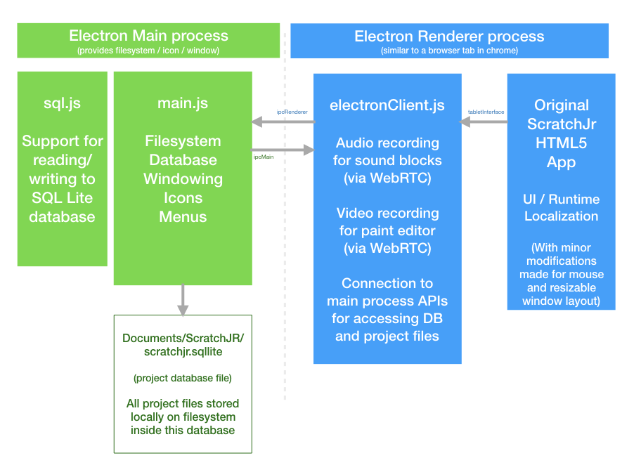

## Downloads

To download this app to your computer, please visit this page:
(https://jfo8000.github.io/ScratchJr-Desktop/)

## Overview

This repository contains a port of ScratchJr for Desktop. 

It has been ported with love from the iPad / Android editions to Mac/Windows
as an independent, open source community project.

If you are looking for the Official ScratchJr build from MIT for Android and iPad, visit
the LLK/ScratchJr (https://github.com/LLK/scratchjr) repository.

## About Electron and Electron Forge

This port makes use of Electron to host the ScratchJR HTML5 application on Mac and Windows.

Electron (https://electronjs.org/) is a framework for creating native applications with web technologies like JavaScript, HTML, and CSS.   

Electron Forge (https://electronforge.io/) stitches together several electron modules to provide easier support for using the latest version 
of javascript, making dmg/exe files and installers.     

## Architecture Overview

* The HTML5 side of Scratch Jr very close to the original ios / android versions.  Some changes had to be made to load modules correctly inside of the electron environment.  
* Minor changes were made to the CSS stylesheets to support resizing.
* Touch events were translated to mouse events.

 
## ElectronDesktopInterface as a third tabletInterface

The original html implementation called out to a tabletInterface to make calls to 
the host operating system (Android / iOS) for filesystem access and audio and video recording.

 
ElectronDesktopInterface handles these calls and either handles them itself in HTML5 
(e.g. audio and video recording are achieved through the HTML5 WebRTC apis) or passes them
onto the electron main process to read and write files / db.

 
## Sql.js 

As the database is rather small we were able to use a version of SQLLite that has been compiled into JavaScript.

The database is largely the same format as the original ios / android version, but it adds
a third table called PROJECTFILES.  Instead of writing individual svg, video, and audio files out to 
the filesystem they are all stored within the PROJECTFILES table.   This was done so that
you can make a set of Scratch Jr projects as a starter kit. 

## Building

You will need node.js installed. (https://nodejs.org/en/)
Also git (which you may already have).

* <tt>npm install</tt>
* <tt>npm run start</tt>

## Packaging for Windows / Mac

For windows installers, you must do this from a Windows machine.  Same for Mac.

* <tt>npm run package</tt>

## Running lint

We use eslint to verify the install.  Our configuration is similar to airbnb, however 
several style rules had to be adapted to avoid changing the original scratch sources.

* <tt>npm run lint</tt>

## Debugging

To debug the html files, audio and video recording you can simply run
* <tt>npm run start</tt>

A chrome inspector window will appear by default.

To debug writing to the filesystem and database queries, you need to debug the main 
electron process.  This is done by 

* <tt>npm run debugMain</tt>

To get the chrome inspector window, open another instance of the real chrome on your computer
and navigate to chrome://inspect

There should be a listing there for the electron main process.
Note between debugging sessions you may have to close and reopen this chrome://inspect window.

## Directory Structure and Projects
This repository has the following directory structure:

* <tt>package.json</tt> - Contains eslint rules, modules used, build and packaging scripts
* <tt>forge.config.js</tt> - Contains rules for packaging for windows and Mac
* <tt>src/app/</tt> - Shared JavaScript code for iOS and Android and Desktop common client. This is where most changes should be made for features, bug fixes, UI, etc.
* <tt>src/icons/</tt> - Icons for Mac / Windows and ( in theory Linux  NYI) 
* <tt>out/</tt> - Build scripts and other executables
* <tt>docs/</tt> - Developer Documentation

## Acknowledgments

Thank you to the official Scratch team and their supporters.  Their contributions are listed here:
https://github.com/LLK/scratchjr

In addition, thank you to the folks working on Electron, ElectronForge, and Sql.js.

Thank you to AppVeyor and Travis CL for providing Mac, Windows and Linux builds.

## Disclaimers

THIS SOFTWARE IS PROVIDED BY THE COPYRIGHT HOLDERS AND CONTRIBUTORS "AS IS" AND ANY EXPRESS OR IMPLIED WARRANTIES, INCLUDING, BUT NOT LIMITED TO, THE IMPLIED WARRANTIES OF MERCHANTABILITY AND FITNESS FOR A PARTICULAR PURPOSE ARE DISCLAIMED. IN NO EVENT SHALL THE COPYRIGHT HOLDER OR CONTRIBUTORS BE LIABLE FOR ANY DIRECT, INDIRECT, INCIDENTAL, SPECIAL, EXEMPLARY, OR CONSEQUENTIAL DAMAGES (INCLUDING, BUT NOT LIMITED TO, PROCUREMENT OF SUBSTITUTE GOODS OR SERVICES; LOSS OF USE, DATA, OR PROFITS; OR BUSINESS INTERRUPTION) HOWEVER CAUSED AND ON ANY THEORY OF LIABILITY, WHETHER IN CONTRACT, STRICT LIABILITY, OR TORT (INCLUDING NEGLIGENCE OR OTHERWISE) ARISING IN ANY WAY OUT OF THE USE OF THIS SOFTWARE, EVEN IF ADVISED OF THE POSSIBILITY OF SUCH DAMAGE.

For more information, see [CONTRIBUTING.md](CONTRIBUTING.md).

